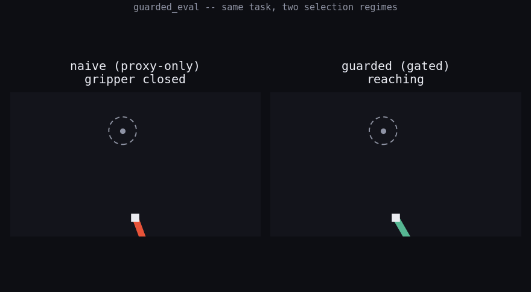

# guarded_eval

**Does the robot actually succeed, or just look like it did?**

Two identical 2-link arms attempt the same reach-and-grab task, live, side
by side. One is bred generation after generation purely to maximize a cheap
proxy score. The other has to clear a cheap ground-truth check *before* the
same proxy score is even allowed to rank it. Same starting population, same
tasks, same mutation rate — the only difference is whether ground truth
gets a vote.

<p align="center">
  
</p>
<p align="center"><sub>real rollout of both champions from a seed-9 run — not staged. naive's gripper closes early and stops; guarded reaches, dwells, and confirms.</sub></p>

## The one-sentence version

Naive selection optimizes what it's told to; guarded selection is bred to
survive a check it wasn't directly optimized against — and only one of them
turns out to have actually learned the task.

## What's being measured

| | naive | guarded |
|---|---|---|
| ranked by | `proxy_score` only | `proxy_score`, but only among genomes that pass `cheap_gate` |
| ground truth ever consulted? | no | yes, cheaply, every generation |
| failure mode | proxy climbs, real task performance never appears | gate starves early on some seeds, but recovers |
| unfilled elite slots | mutate the proxy leaders again | **fresh random genomes** — never backfilled with more proxy-only winners |

`proxy_score`: one clean, noise-free rollout, scored by closest approach to
the target. Never checks whether the arm actually grabbed and held it.

`truth_score` / `cheap_gate`: several *noisy* rollouts, scored by a strict
event — gripper closed, within radius, held for 5 consecutive ticks. A
policy can max out `proxy_score` by hovering near the target forever
without ever passing this.

That gap between the two scores is the entire experiment. Everything else
— the arm, the ROS topics, the dashboard — exists to make that gap watchable.

## Real results, not tuned to fit the story

A 26-generation run at seed 9, held-out evaluation tasks neither selection
loop ever sees:

```
gen  0   naive proxy=-0.590 truth=0.000  |  guarded proxy=-0.590 truth=0.000
gen  9   naive proxy=-0.166 truth=0.000  |  guarded proxy=-0.650 truth=0.056  passers=1/24
gen 18   naive proxy=-0.096 truth=0.000  |  guarded proxy=-0.515 truth=0.083  passers=6/24
gen 26   naive proxy=-0.096 truth=0.000  |  guarded proxy=-0.247 truth=0.056  passers=10/24
```

Naive's proxy score genuinely improves the entire run. Its real success
rate never leaves zero — not a collapse from a peak, it simply never finds
the confirming behavior at all, while getting steadily "better" by its own
metric. Guarded's gate starts starved (0 passers for several generations)
then recovers, and its real success rate becomes reliably nonzero once it
does.

Not every seed tells this clean a story — seed 7 is a disclosed failure
mode where the gate itself starves for the entire run and guarded
degenerates into random search too. That's in `guarded_eval/README.md`,
left in rather than tuned away.

## Run it

A full ROS 2 package (`ament_python`, Humble/Iron/Jazzy) — two live nodes
running the selection loops and the arm simulation, a launch file, and a
browser dashboard over rosbridge. Only `numpy` + stock ROS message types,
no custom `.msg` files.

```bash
cd guarded_eval
colcon build --symlink-install   # from a workspace root containing this as src/guarded_eval
source install/setup.bash
bash run_demo.sh                 # scans for a free rosbridge port, launches everything
```

See [`guarded_eval/README.md`](guarded_eval/) for the full architecture,
no-sudo ROS 2 setup via RoboStack/conda, topic reference, and seed notes.

## Layout

```
guarded_eval/
  guarded_eval/core.py       pure numpy: arm kinematics, policy, evaluators, both selection loops
  guarded_eval/selection_node.py   runs naive + guarded selection, one generation per tick
  guarded_eval/sim_node.py         steps both live arms, publishes joint states + robot state
  launch/demo.launch.py      rosbridge + both nodes
  dashboard/dashboard.html   self-contained live dashboard (roslib.js, canvas rendering)
  run_demo.sh                port-safe launcher
  demo.gif                   the clip above, generated straight from core.py's own rollout data
```
